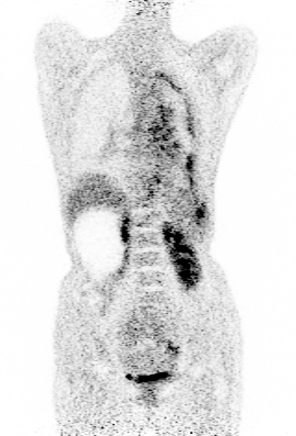

# Code for UPSN will be available soon!

<table frame=void>
	<tr>
        <td>

        	
        	 
            
(a) Low-dose (CRF=6)

        

</td>    
     	<td>

    		
    		 
            
(b) 3D-cGAN

        

</td>
	</tr>	
    <tr>	<!--第二行-->
        <td>

        	
        	 
            
(c) UDSN

        

</td>    
     	<td>

    		
    		 
            
(d) Full-dose

        

</td>
	</tr>
</table>

